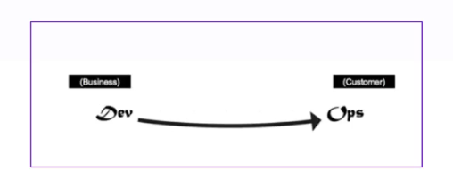
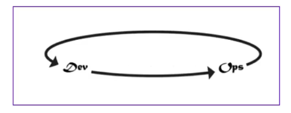
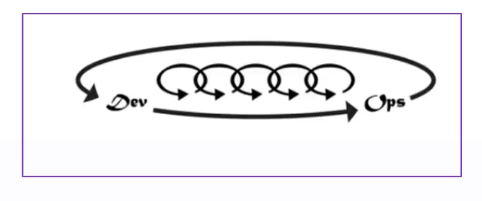

# As Três Maneiras do DevOps

As Três Maneiras são princípios fundamentais para a adoção de práticas DevOps. Elas ajudam a otimizar o fluxo de trabalho, melhorar o feedback e promover o aprendizado organizacional. Abaixo estão os pilares de cada uma delas:

## 1. A Primeira Maneira: **Fluxo**

A Primeira Maneira foca em criar um fluxo eficiente desde o desenvolvimento até a entrega ao cliente.

- **Fluxo de trabalho rápido**: Reduzir o tempo entre a criação e a entrega.
- **Foco em visibilidade**: Garantir que todos os envolvidos tenham clareza sobre o processo.
- **Otimizações constantes**: Melhorar continuamente para evitar desperdícios.
- **Intervalos concisos**: Minimizar esperas desnecessárias.
- **Automatização**: Eliminar tarefas manuais repetitivas.

---

## 2. A Segunda Maneira: **Feedback**

A Segunda Maneira se concentra no ciclo de feedback constante, garantindo a detecção precoce de problemas.

- **Feedback rápido e constante**: Coletar informações em todas as etapas.
- **Detecção de erros**: Identificar falhas antes que elas impactem o sistema.
- **Recuperações mais rápidas**: Responder rapidamente a problemas, aumentando a confiabilidade.

---

## 3. A Terceira Maneira: **Aprendizado e Experimentação**

A Terceira Maneira promove uma cultura de aprendizado contínuo e inovação organizacional.

- **Foco em produtividade**: Garantir que as equipes sejam eficazes e inovadoras.
- **Aprendizado organizacional**: Compartilhar lições aprendidas para melhorar práticas.
- **Features locais e globais**: Avaliar o impacto de mudanças no sistema como um todo.

---

Esses princípios são a base para integrar equipes, automatizar processos e promover melhorias contínuas no ciclo de vida de software.
